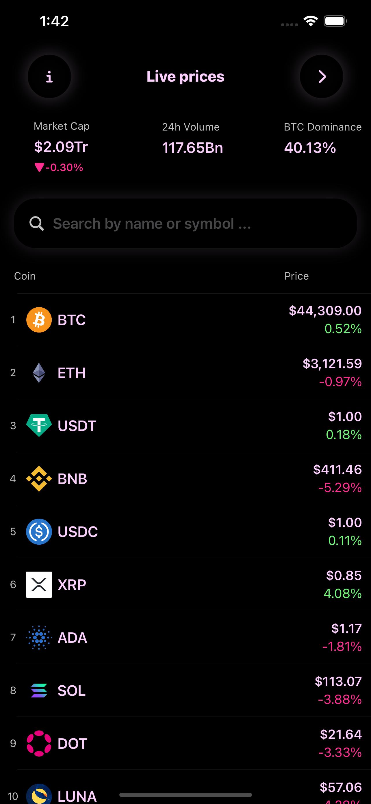

# Coin Radar
# Screenshots

## About
Coin Radar is a 

## Features

## Requirements 

## Architecture

## HomeView

## SettingView

## DetailView 

## PortfolioView

# Documentation
## Model
### Coin
--
### Statistic
--
### MarketData
--
### CoinDetaileData

## View
### CoinRadarApp
--
### Lunch 
--
### Components -> CircleButton
### Components -> CircleButtonAnimation
### Components -> CoinImageView
### Components -> SearchBarView
### Components -> StatisticeView
### Components -> CloseButton
### Components -> CoinLogoView
--
### Home -> HomeView
### Home -> HomeStatView
### Home -> CoinRowView
### Home -> PortfolioView
--
### Detail -> DetailView
### Detail -> ChartView
--
### Settings -> SettingView

## ViewModels
### Components -> CoinImageViewModel
--
### Home -> HomeViewModel
--
### Detail -> DetailViewModel
--
### Settings -> SettingViewModel

## Services
### CoreDataServices -> PortfolioDataService
--
### APIServices -> CoinAPIService
### APIServices -> CoinImageService
### APIServices -> MarketAPIService
### APIServices -> CoinDetailAPIService

## Resources
### CoreData -> PortfolioContainer
--
### Assets 

## Utils 
### Singletons -> DeveloperPreview
### Singletons -> SharedResources
### Singletons -> NetworkManager
### Singletons -> LocalFileManager
### Singletons -> HapticManager
--
### Modifiers -> Frame
--
### Globals -> DeviceAttribtes
--
### Enums -> AppStyle
### Enums -> Device
### Enums -> Errors
### Enums -> SortOptions
--
### Extensions -> Color
### Extensions -> View
### Extensions -> PreviewProvider
### Extensions -> Double
### Extensions -> UIAplication
### Extensions -> Date
### Extensions -> String  

# Links

[API](https://api.coingecko.com/api/v3/coins/markets?vs_currency=usd&order=market_cap_desc&per_page=250&page=1&sparkline=true&price_change_percentage=24h)
[API Website](https://www.coingecko.com/en/api)

[Tutorial Github page](https://github.com/SwiftfulThinking)

# Tools
[Convert JSON data to Swift Model](https://app.quicktype.io/)

## Tasks
- [ ] Check how much bandwich each download uses
- [ ] Create a error system
- [ ] Add a Repository level between Services and ViewModels
- [ ] Remove by swiping 
- [x] The pull down functionality(for coin lists)
- [ ] Find another view to make the Coin cell view clickable (currenctly is with background color)
- [ ] Protocol for API Service and put all the API Links there 
- [ ] Show Error for network problems
- [ ] Downloading All coins 
- [ ] Decimal keyboard on Ipad
- [ ] Default background modifier
- [ ] Architecture improvements: Protocols, dependency injection
